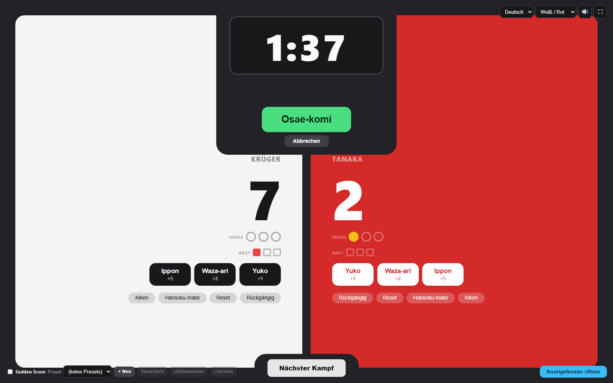
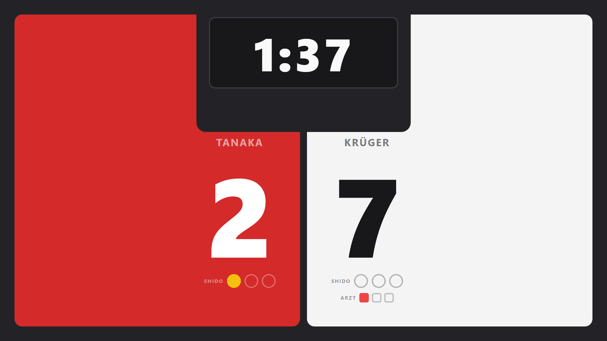

# Judo Score

**Sprachen: [English](README.md) · Deutsch**

Eine kostenlose Judo-Anzeigetafel für Training, Vereinskämpfe und kleine Turniere.
Sie läuft komplett im Webbrowser – **nichts zu installieren, kein Internet nötig,
kein Konto.**

Sie besteht aus nur **zwei Dateien**:

| Datei | Was es ist | Wohin damit |
| --- | --- | --- |
| `control.html` | Das **Bedien-Fenster**. Hier klickst du, um den Kampf zu führen (Punkte, Zeit, Strafen …). | Auf den Laptop der Person am Tisch. |
| `display.html` | Das **Zuschauer-Fenster**. Groß, aufgeräumt, nur zum Anschauen. Folgt dem Bedien-Fenster live. | Auf den Fernseher / Beamer / zweiten Monitor, der zu den Kämpfern und zum Publikum zeigt. |

| Bedien-Fenster | Zuschauer-Anzeige |
| --- | --- |
|  |  |

---

## Schnellstart für komplette Neulinge

Du musst **kein** Technik-Mensch sein. Das ist der ganze Ablauf:

### 1. Herunterladen

- Öffne die Projektseite: <https://github.com/lena-suslik/judo_score>
- Klick auf den grünen Knopf **`Code`** und dann auf **`Download ZIP`**.
- Speichere die Datei irgendwo, wo du sie wiederfindest (z. B. auf dem Desktop).

### 2. Entpacken

- **Windows:** Rechtsklick auf die heruntergeladene `judo_score-main.zip` →
  **Alle extrahieren…** → **Extrahieren**.
- **Mac:** Doppelklick auf die ZIP-Datei.

Jetzt hast du einen Ordner `judo_score` (oder `judo_score-main`) mit den beiden
Dateien `control.html` und `display.html` darin.
**Lass diese zwei Dateien zusammen im selben Ordner.**

### 3. Öffnen

- Doppelklick auf **`control.html`**.
- Sie öffnet sich in deinem normalen Browser (Chrome oder Edge empfohlen,
  Firefox geht auch).
- Das ist das Bedien-Fenster – du kannst sofort einen Kampf werten.

### 4. Für den Raum anzeigen (optional, aber genau darum geht es)

- Schließe deinen zweiten Bildschirm / Beamer / Fernseher an.
- Klick im Bedien-Fenster unten rechts auf **`Anzeigefenster öffnen`**.
- Ein zweites Fenster öffnet sich – das ist die Zuschauer-Anzeige.
- Zieh dieses Fenster auf den großen Bildschirm und drücke **`F`** für Vollbild.

Fertig. Nach dem Download kannst du es für immer benutzen – offline, im Flugzeug,
in einer Halle ohne WLAN, egal.

> **Ja – du brauchst wirklich nur die zwei Dateien in einem Ordner.** Keine
> Einrichtung, kein Server, kein Build-Schritt. Doppelklick auf `control.html`
> ist die ganze „Installation“.

---

## Wie die zwei Fenster miteinander reden

Beide Fenster sind **im selben Browser auf demselben Computer** offen. Sie teilen
ihre Daten über den Browser selbst (kein Netzwerk). Das heißt:

- ✅ Zwei Fenster / zwei Monitore an **einem** Computer → funktioniert einwandfrei.
- ❌ Bedienung auf dem einen Laptop, Anzeige auf einem anderen Laptop → das wird
  **nicht** synchron laufen.
- 👍 Am besten: die Anzeige mit dem Knopf **`Anzeigefenster öffnen`** starten,
  nicht `display.html` von Hand öffnen.
- Das Bedien-Fenster funktioniert auch allein, wenn du nur einen Monitor hast.

---

## Einen Kampf führen

### Kämpfer

- Zwei Seiten: **Weiß** und **Rot** (Rot lässt sich auf **Blau** umstellen – siehe
  Einstellungen).
- Klick auf den **Namen** eines Kämpfers, um den echten Namen einzutippen. Leer
  lassen für „Kämpfer 1 / 2“.
- **Rechtsklick** auf **`Nächster Kampf`**, um schon die Namen des *nächsten*
  Paares einzutragen, während der aktuelle Kampf noch läuft.

### Punkte

- Die Knöpfe **Yuko / Waza-ari / Ippon** geben der Seite Punkte.
- Standard-Punktwerte: Yuko = 1, Waza-ari = 2, Ippon = 5. **Rechtsklick** auf einen
  Punkte-Knopf ändert seinen Wert.
- Klick auf die große **Zahl** für ein schnelles **+1**, Rechtsklick für **−1**.
- Eine Seite mit **10 Punkten** oder als Sieger erklärt bekommt einen goldenen
  Rahmen und ein **SIEG**-Abzeichen; die andere Seite wird abgedunkelt.

### Strafen (Shido)

- Drei Kreise pro Seite. **Klick** = +1 Shido, **Rechtsklick** = −1.
- Das **3. Shido = Hansoku-make**: die andere Person gewinnt sofort. Das Shido
  zurücknehmen nimmt auch den Sieg zurück.
- Im **Golden Score** verliert *jedes* Shido den Kampf.

### Arzt-Einsätze

- Drei Quadrate pro Seite, um festzuhalten, wie oft der Arzt auf die Matte musste.
- Klick = +1, Rechtsklick = −1. Auf der Zuschauer-Anzeige erst sichtbar, wenn es
  benutzt wurde.

### Direkte Ergebnisse

- Knopf **`Hansoku-make`** – diese Person verliert sofort. Nochmal klicken hebt es auf.
- Knopf **`Kiken`** – diese Person gibt auf oder tritt nicht an, also gewinnt der
  Gegner (*Kiken-gachi*, wenn der Kampf begonnen hatte, *Fusen-gachi*, wenn nicht).
  Nochmal klicken hebt es auf.
- **`Rückgängig`** – nimmt die letzte Wertung dieser Seite zurück.
- **`Reset`** – setzt Punkte, Shido und Arzt-Zähler dieser Seite auf 0
  (mit Sicherheitsabfrage).

### Hauptzeit (Timer)

- Standard **2:30**. **Klick** darauf oder **Leertaste** zum Starten / Stoppen.
- **`R`** setzt zurück. **Rechtsklick**, um eine andere Kampfzeit einzustellen
  (Minuten / Sekunden).
- Bei 0:00 ertönt ein **Signalton**.
- Farbe: weiß = gestoppt, grün = läuft, rot = Zeit abgelaufen, gold = Golden Score.

### Wenn die Zeit bei Gleichstand abläuft

- **Golden Score AN** (Häkchen unten links): der Timer wird gold und zählt von 0
  **aufwärts**. Die erste Wertung – oder das erste Shido gegen einen – entscheidet.
- **Golden Score AUS:** die Anzeige wechselt zu **Hantei**. Mit den Pfeilen
  **← / →** (oder den Pfeilen am Bildschirm) den Sieger per Kampfrichterentscheid
  wählen.

### Osae-komi (Haltegriff-Uhr)

- Den großen Knopf **`Osae-komi`** drücken (oder Taste **`M`**), wenn ein Haltegriff
  beginnt. Die Uhr zählt aufwärts.
- Den Griff mit den Pfeilen **◀ / ▶** (oder Tasten **← / →**) einer Seite zuweisen.
- Vor dem Zuweisen: Klick auf die Uhr **pausiert / setzt fort**.
  Nach dem Zuweisen: Klick auf die Uhr **stoppt und wertet**.
- **`Abbrechen`** beendet den Griff ohne Punkte.
- Yuko / Waza-ari / Ippon werden automatisch nach der gehaltenen Zeit vergeben.
  Standard-Schwellen: 5 s / 10 s / 20 s – **Rechtsklick** auf die Uhr, um sie zu ändern.
- Läuft die Hauptzeit während eines Griffs ab, friert der Griff ein, kann aber noch
  beendet und gewertet werden; danach läuft die Zeitablauf-Logik weiter.

### Nächster Kampf

- Knopf **`Nächster Kampf`** (Taste **`N`**) – einmal tippen zum Vorbereiten,
  nochmal tippen zum Bestätigen.
- Setzt Punkte, Strafen, Arzt-Zähler, Timer und Kampfstatus zurück.
- Behält die Namen (oder übernimmt die Namen, die du per Rechtsklick vorbereitet hast).

---

## Einstellungen

Alle Einstellungen sitzen am Rand des Bedien-Fensters und werden automatisch gespeichert.

| Einstellung | Wo | Hinweise |
| --- | --- | --- |
| **Sprache** | oben rechts | Deutsch / Englisch. Ändert nur die Texte der Oberfläche. |
| **Farbschema** | oben rechts | Weiß / Rot oder Weiß / Blau. Gilt für beide Fenster. |
| **Ton** | oben rechts, Lautsprecher-Symbol | Signalton und Pieptöne an / aus. |
| **Vollbild** | oben rechts, ⛶-Symbol (Taste `F`) | Setzt beide Fenster in den Vollbildmodus. |
| **Golden Score** | Häkchen unten links | An = Golden Score bei Gleichstand, Aus = Hantei. |
| **Presets** | unten links | Speichert die aktuelle Kampfzeit + Punktwerte + Osae-komi-Schwellen als benanntes Preset. Anwenden über die Auswahlliste oder die Zifferntasten **1–9**. Überschreiben / Umbenennen / Löschen mit den Knöpfen daneben. |

---

## Tastenkürzel

Drücke jederzeit **`?`** im Bedien-Fenster für diese Liste.

| Taste | Aktion |
| --- | --- |
| `Leertaste` | Timer Start / Stopp |
| `R` | Timer zurücksetzen |
| `M` | Osae-komi starten / stoppen |
| `N` | Nächster Kampf |
| `F` | Vollbild (beide Fenster) |
| `A` / `S` / `D` | Weiß: Yuko / Waza-ari / Ippon |
| `J` / `K` / `L` | Rot: Yuko / Waza-ari / Ippon |
| `Q` / `P` | Shido Weiß / Rot |
| `W` / `O` | Rückgängig Weiß / Rot |
| `←` / `→` | Hantei-Sieger · bzw. Osae-komi-Seite zuweisen |
| `1` – `9` | Preset 1–9 anwenden |
| `?` | Diese Kürzel-Liste anzeigen |

> **Tipp:** Fahr mit der Maus über fast jeden Knopf im Bedien-Fenster – nach einem
> Moment erscheint eine kurze Erklärung, was er macht.

---

## Gut zu wissen

- **Alles wird im Browser gespeichert** (Namen, Punkte, Presets, Sprache, Farbschema).
  Tab schließen, `control.html` wieder öffnen – alles ist noch da.
- Weil es pro Browser gespeichert wird: ein *anderer* Browser, ein anderer Computer,
  ein privates / Inkognito-Fenster oder „Browserdaten löschen“ fangen bei null an.
- Der **erste Klick** auf die Seite schaltet den Ton frei (eine Browser-Regel – da
  ist nichts kaputt).
- Es verlassen keine Daten deinen Computer. Es gibt keinen Server und kein Tracking.

---

## Haben Projekte normalerweise READMEs in mehreren Sprachen?

Ja, das ist üblich, wenn die Zielgruppe nicht hauptsächlich Englisch spricht. Die
übliche Konvention ist:

- `README.md` – die Standard-Datei, die GitHub anzeigt, normalerweise **Englisch**.
- `README.de.md`, `README.fr.md`, … – eine Datei pro Übersetzung.
- Eine kleine **Sprachumschalter**-Zeile ganz oben, die die Versionen verlinkt
  (wie die Zeile oben in dieser Datei).

Dieses Projekt behält Englisch als Standard-`README.md` und eine vollständige
deutsche Übersetzung in [`README.de.md`](README.de.md). Wenn deine Nutzer
überwiegend deutsch sind, ist es genauso in Ordnung, das zu tauschen (Deutsch als
`README.md`, Englisch als `README.en.md`) – behalte nur die Umschalter-Zeile,
damit man die andere Version findet.

---

## Lizenz

Siehe Repository für Lizenzinformationen.
