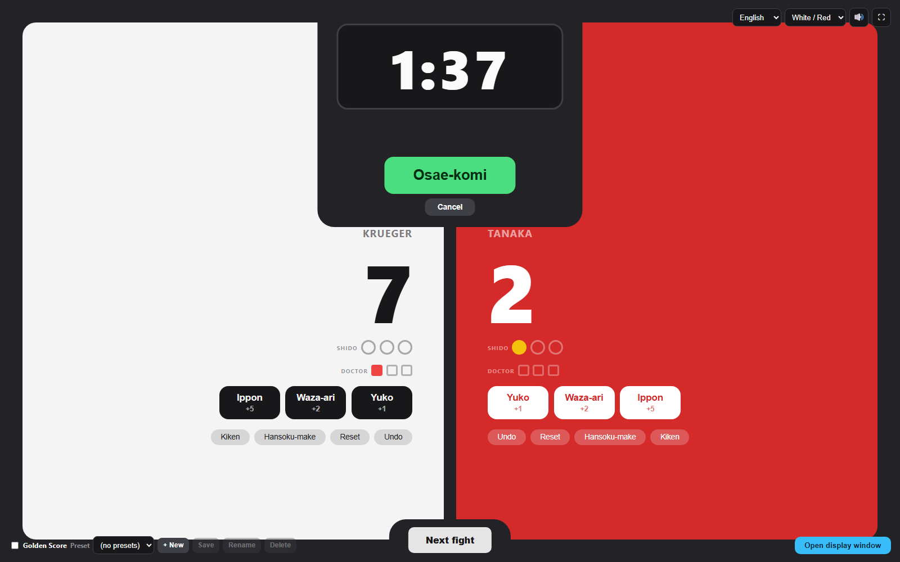
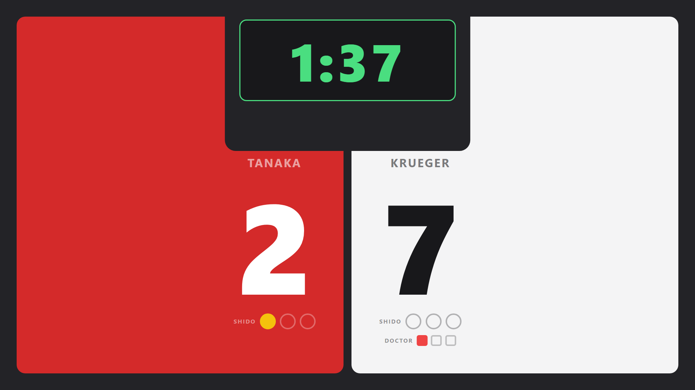

# Judo Score

**Languages: English · [Deutsch](README.de.md)**

*I built this as a small project to try out Claude Code. Feel free to use it, and
feedback is welcome.*

A judo scoreboard for training, club competitions and small tournaments. It runs
in a web browser from two local files. There is no installation, no server and no
network connection; no account is needed.

The two files:

| File | What it is | Where it goes |
| --- | --- | --- |
| `control.html` | The **operator screen**. You click here to run the match (scores, timer, penalties …). | On the laptop of the person running the table. |
| `display.html` | The **audience screen**. Read-only; it follows the control screen live. | On the TV / projector / second monitor that faces the athletes and the public. |

| Control screen | Audience display |
| --- | --- |
|  |  |

---

## Quick start

The full process, no technical knowledge required:

### 1. Download it

- Open the project page: <https://github.com/lena-suslik/judo_score>
- Click the green **`Code`** button, then **`Download ZIP`**.
- Save the file somewhere you will find it again (e.g. your Desktop).

### 2. Unpack it

- **Windows:** right-click the downloaded `judo_score-main.zip` → **Extract All…** → **Extract**.
- **Mac:** double-click the ZIP file.

You now have a folder called `judo_score` (or `judo_score-main`) that contains
`control.html` and `display.html`. **Keep these two files together in the same folder.**

### 3. Open it

- Double-click **`control.html`**.
- It opens in your normal web browser (Chrome or Edge recommended, Firefox works too).
- This is the operator screen – you are ready to score a match.

### 4. Show it on a second screen (optional)

- Connect your second screen / projector / TV.
- In the control window, click **`Open display window`** (bottom-right).
- A second window opens – this is the audience display.
- Drag that window onto the big screen and press **`F`** to make it fullscreen.

Once downloaded, it works offline with no further setup.

> The two files in one folder are all that is required. There is no setup step,
> no server and no build step.

---

## How the two windows talk to each other

Both windows are open **in the same browser on the same computer**. They share
their data through the browser itself (no network). This means:

- Two windows or two monitors on **one** computer: works.
- Control on one laptop, display on a different laptop: does **not** sync.
- Open the display with the **`Open display window`** button rather than opening
  `display.html` by hand.
- The control screen also works on its own if you only have one monitor.

---

## Running a match

### Fighters

- Two sides: **White** and **Red** (Red can be switched to **Blue** – see Settings).
- Click a fighter's **name** to type the real name. Leave it empty for "Fighter 1 / 2".
- Right-click **`Next fight`** to pre-enter the names of the *next* pair while the
  current match is still running.

### Score

- Buttons **Yuko / Waza-ari / Ippon** add points to that side.
- Default point values: Yuko = 1, Waza-ari = 2, Ippon = 5. **Right-click** a score
  button to change its value.
- Click the big **number** for a quick **+1**, right-click it for **−1**.
- A side that reaches **10 points** or is declared the winner shows a golden border
  and a **WIN** badge; the other side dims.

### Penalties (Shido)

- Three circles per side. **Click** = +1 shido, **right-click** = −1.
- The **3rd shido = Hansoku-make**: the other fighter wins immediately.
  Taking the shido back also takes the win back.
- During **Golden Score**, *any* shido loses the match.

### Doctor calls 

- Three squares per side to record how often the doctor had to come onto the mat.
- Click = +1, right-click = −1. Shown on the audience screen only once it is used.

### Direct results

- **`Hansoku-make`** button – this fighter loses at once. Click again to undo.
- **`Kiken`** button – this fighter gives up or does not show up, so the opponent
  wins (*Kiken-gachi* if the fight had started, *Fusen-gachi* if it never did).
  Click again to undo.
- **`Undo`** – takes back the last score on that side.
- **`Reset`** – sets that side's score, shido and doctor count back to 0
  (asks for a confirmation click).

### Main timer

- Default **2:30**. **Click** it or press **Space** to start / stop.
- **`R`** resets it. **Right-click** to set a different match time (minutes / seconds).
- A **buzzer** sounds at 0:00.
- Colour: white = stopped, green = running, red = time up, gold = Golden Score.

### When time runs out on a tie

- **Golden Score ON** (checkbox, bottom-left): the timer turns gold and counts
  **up** from 0. The first score – or the first shido against – decides the match.
- **Golden Score OFF:** the screen switches to **Hantei**. Use the **← / →** arrows
  (or the on-screen arrows) to pick the winner by referee decision.

### Osae-komi (hold-down) timer

- Press the big **`Osae-komi`** button (or key **`M`**) when a hold starts. It counts up.
- Assign the hold to a side with the **◀ / ▶** arrows (or **← / →** keys).
- Before assigning: click the clock to **pause / resume**.
  After assigning: click the clock to **stop and score**.
- **`Cancel`** ends the hold with no points.
- It automatically awards Yuko / Waza-ari / Ippon based on the seconds held.
  Default thresholds: 5 s / 10 s / 20 s – **right-click** the clock to change them.
- If the main time runs out during a hold, the hold freezes but can still be
  finished and scored; then the end-of-time logic continues.

### Next fight

- **`Next fight`** button (key **`N`**) – tap once to arm, tap again to confirm.
- Resets scores, penalties, doctor counts, timer and match state.
- Keeps the fighter names (or swaps in the names you queued with right-click).

---

## Settings

All settings sit around the edges of the control window and are saved automatically.

| Setting | Where | Notes |
| --- | --- | --- |
| **Language** | top-right | German / English. Changes the interface text only. |
| **Colour scheme** | top-right | White / Red or White / Blue. Applies to both windows. |
| **Sound** | top-right speaker icon | Buzzer and beeps on / off. |
| **Fullscreen** | top-right ⛶ icon (key `F`) | Puts both windows into fullscreen. |
| **Golden Score** | bottom-left checkbox | On = Golden Score on a tie, Off = Hantei. |
| **Presets** | bottom-left | Save the current match time + point values + osae-komi thresholds as a named preset. Apply with the dropdown or number keys **1–9**. Update / rename / delete with the buttons next to it. |

---

## Keyboard shortcuts

Press **`?`** in the control window for this list at any time.

| Key | Action |
| --- | --- |
| `Space` | Timer start / stop |
| `R` | Reset timer |
| `M` | Osae-komi start / stop |
| `N` | Next fight |
| `F` | Fullscreen (both windows) |
| `A` / `S` / `D` | White: Yuko / Waza-ari / Ippon |
| `J` / `K` / `L` | Red: Yuko / Waza-ari / Ippon |
| `Q` / `P` | Shido White / Red |
| `W` / `O` | Undo White / Red |
| `←` / `→` | Hantei winner · or assign the osae-komi hold |
| `1` – `9` | Apply preset 1–9 |
| `?` | Show this shortcut list |

> **Tip:** hover the mouse over almost any button in the control window and a short
> explanation of what it does appears after a moment.

---

## Good to know

- **Everything is saved in your browser** (names, scores, presets, language, theme).
  Close the tab and reopen `control.html` and it is all still there.
- Because it is stored per-browser: a *different* browser, another computer, a
  private / incognito window, or "clear browsing data" all start from scratch.
- The **first click** on the page unlocks the sound (a browser rule).
- No data leaves your computer. There is no server and no tracking.

## License

MIT – see [LICENSE](LICENSE). You can use, change and share it freely; it comes
with no warranty.
